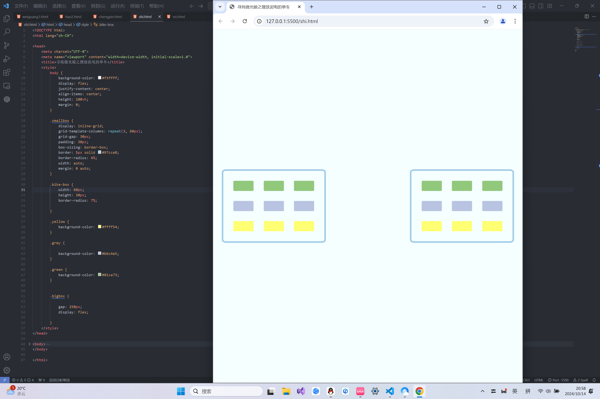
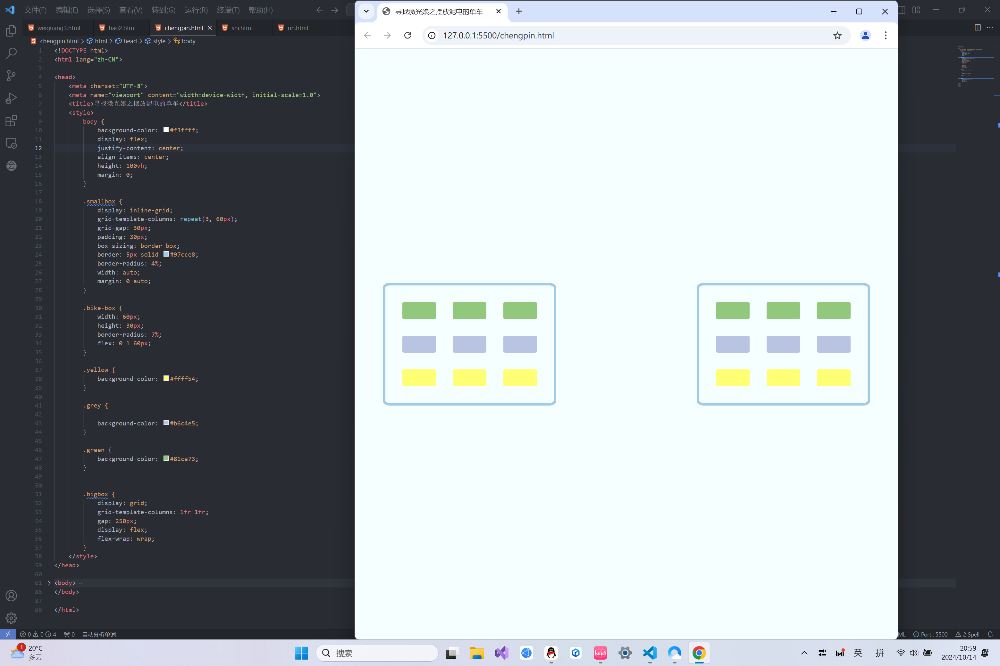
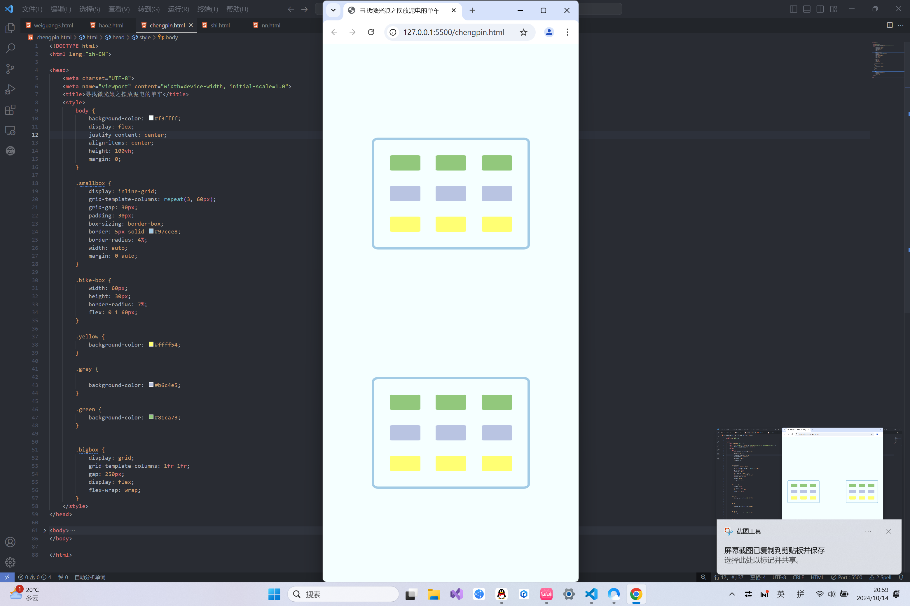

# <center><font color=blue>开辟找到微光娘的道路</font></center>
## 第1，2，3点：
### 代码：
```
<!DOCTYPE html>
<html lang="zh-CN">

<head>
    <meta charset="UTF-8">
    <meta name="viewport" content="width=device-width, initial-scale=1.0">
    <title>寻找微光娘之摆放泥电的单车</title>
    <style>
        body {
            background-color: #f3ffff;
            display: flex;
            justify-content: center;
            align-items: center;
            height: 100vh;
            margin: 0;
        }

        .smallbox {
            display: inline-grid;
            grid-template-columns: repeat(3, 60px);
            grid-gap: 30px;
            padding: 30px;
            box-sizing: border-box;
            border: 5px solid #97cce8;
            border-radius: 4%;
            width: auto;
            margin: 0 auto;
        }

        .bike-box {
            width: 60px;
            height: 30px;
            border-radius: 7%;
            
        }

        .yellow {
            background-color: #ffff54;
        }

        .grey {

            background-color: #b6c4e5;
        }

        .green {
            background-color: #81ca73;
        }


        .bigbox {
            
            gap: 250px;
            display: flex;
            
        }
    </style>
</head>

<body>
    <div class="bigbox">
        <div class="smallbox">
            <div class="bike-box green"></div>
            <div class="bike-box green"></div>
            <div class="bike-box green"></div>
            <div class="bike-box grey"></div>
            <div class="bike-box grey"></div>
            <div class="bike-box grey"></div>
            <div class="bike-box yellow"></div>
            <div class="bike-box yellow"></div>
            <div class="bike-box yellow"></div>
        </div>
        <div class="smallbox">
            <div class="bike-box green"></div>
            <div class="bike-box green"></div>
            <div class="bike-box green"></div>
            <div class="bike-box grey"></div>
            <div class="bike-box grey"></div>
            <div class="bike-box grey"></div>
            <div class="bike-box yellow"></div>
            <div class="bike-box yellow"></div>
            <div class="bike-box yellow"></div>
        </div>
    </div>
</body>

</html>
```
### 图例：


## 第4点：
### 代码：
```
<!DOCTYPE html>
<html lang="zh-CN">

<head>
    <meta charset="UTF-8">
    <meta name="viewport" content="width=device-width, initial-scale=1.0">
    <title>寻找微光娘之摆放泥电的单车</title>
    <style>
        body {
            background-color: #f3ffff;
            display: flex;
            justify-content: center;
            align-items: center;
            height: 100vh;
            margin: 0;
        }

        .smallbox {
            display: inline-grid;
            grid-template-columns: repeat(3, 60px);
            grid-gap: 30px;
            padding: 30px;
            box-sizing: border-box;
            border: 5px solid #97cce8;
            border-radius: 4%;
            width: auto;
            margin: 0 auto;
        }

        .bike-box {
            width: 60px;
            height: 30px;
            border-radius: 7%;
            flex: 0 1 60px;
        }

        .yellow {
            background-color: #ffff54;
        }

        .grey {

            background-color: #b6c4e5;
        }

        .green {
            background-color: #81ca73;
        }


        .bigbox {
            display: grid;
            grid-template-columns: 1fr 1fr;
            gap: 250px;
            display: flex;
            flex-wrap: wrap;
        }
    </style>
</head>

<body>
    <div class="bigbox">
        <div class="smallbox">
            <div class="bike-box green"></div>
            <div class="bike-box green"></div>
            <div class="bike-box green"></div>
            <div class="bike-box grey"></div>
            <div class="bike-box grey"></div>
            <div class="bike-box grey"></div>
            <div class="bike-box yellow"></div>
            <div class="bike-box yellow"></div>
            <div class="bike-box yellow"></div>
        </div>
        <div class="smallbox">
            <div class="bike-box green"></div>
            <div class="bike-box green"></div>
            <div class="bike-box green"></div>
            <div class="bike-box grey"></div>
            <div class="bike-box grey"></div>
            <div class="bike-box grey"></div>
            <div class="bike-box yellow"></div>
            <div class="bike-box yellow"></div>
            <div class="bike-box yellow"></div>
        </div>
    </div>
</body>

</html>
```
### 图例：



# <center><font color=red>Thanks for Watching！</font></center>