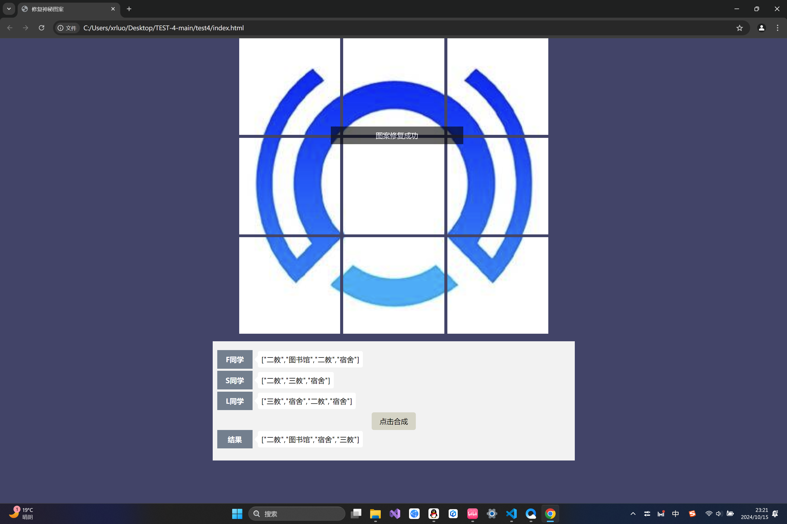

# <center><font color=blue>通往微光娘的最后一扇门——JavaScript</font></center>
## 以下为完善后的代码：
```
function collectPuzzle(...puzzles) {
  // TODO:在这里写入具体的实现逻辑
  // 对所有的碎片进行收集，获取不同拼图类型的结果，并返回
  const array1 = ["二教", "图书馆", "二教", "宿舍"];
  const array2 = ["二教", "三教", "宿舍"];
  const array3 = ["三教", "宿舍", "二教", "宿舍"];

  const tuan = [...array1, ...array2, ...array3];
  const mubiao = new Set(tuan);
  const jieguo = [...mubiao];
  return jieguo
}
```
 **我的思路：不管三七二十一，先把它们揉成一团，去除重复项后再复原成目标数组。これでよし！**
## 附上一张效果图：

<font color=yellow>微光娘，我要进来喽~</font>